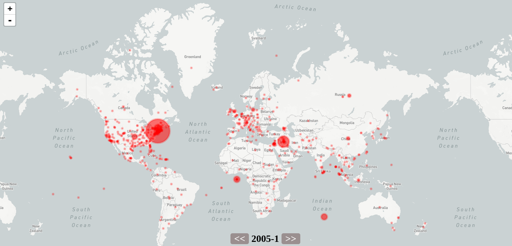

# New York Times articles research
> Інтерактивна мапа на основі публікацій NYT

Карта базується на статтях, котрі були опубліковані в New York Times та де згадується певна локація(місто, країна і т.д.). 
Проект складається з двох частин: робота з даними та веб-частина, котра відображає карту.



## How it works?
Все відбувається у два етапи:

1.  Збір інформації. Головним чином цим займається модуль **processing** використовуючи для цього інші модулі(Article, ArchiveApi, Geolocation), котрі будуть описані нижче. Перш за все загружаються усі статті за певний місяць та очищаються від непотрібних даних, щоб в результаті у них залишилась лише дата публікації, заголовок та ключові слова, де і є вказано місце, про яке йдеться у статті. Потім за допомогою ArticleProcess обробляється ця інформація, таким чином, щоб дізнатись про яке місце яка кількість статей була написана. І в самому кінці для цього місця ми отримуємо геологікацію за допомогою модуля Geolocation, щоб це в подальшому розмістити на карті. Ці дані у форматі json ми записуємо у файли з назвами {year}-{month}.json
2. Веб частина.  Фронтенд зроблений таким чином, що посилає запити на сервер, котрий написаний на flask щоб отримати файли, про які йшлося вище і їх відобазити на інтерактивній карті. Для її створення було використано leaflet.js 

## Structure

Структура проекту:

- app/ - веб-частина(frontend, backend)
- data/ - усі оброблені дані(описано у частині *How it works?*)
- doc/ - документація по проекту
- examples/ - приклади коду
- html/ - автоватично згенерована документація до модулів програми
- modules/ - усі модулі програми(детальніше у *Usage example*) 
- tests/ - тести
- run.py - скрипт для запуску сайту
- requirements.txt - список усіх залежностей, які вимагає проект

## Installation

Вам неохідно лише клонувати проект і ви зможете ним користуватись!

```sh
git clone https://github.com/Retsediv/NYT_course_project.git
```

## Usage example

Щоб запустити сервер та побачити результати дослідження введіть наступне у командному рядку(ви повинні бути в кореневій папці проекту):
```sh
# Якщо у вас встановлено різні версії python, то python3 чи python3.5  
python ./run.py
```
Тоді у браузері відкрийте адресу [http://127.0.0.1:5000/](http://127.0.0.1:5000/) і перед вами буде інтерактивна мапа.

***

Проект складається з кількох модулів. Зараз ми розглянемо кожний з них:

- ArchiveAPI - модуль, котрий є обгорткою для роботи з New York Times Api та базується на проекті [https://github.com/davidcox143/nytimesarchive](https://github.com/davidcox143/nytimesarchive). На жаль в нього немає підтримки роботи з PyPi

```python
# Імпортуємо даний модуль та бібліотеку для роботи з json
from modules.nytapi import ArchiveAPI
import json

# API ключ для роботи з NYT API
NYT_API_KEY = "******************"

# Створюємо об'єкт для роботи з API
api = ArchiveAPI(NYT_API_KEY)

# Перебираємо усі місяці(від 1 до 12) і роки(від 2010 до 2016), для того, щоб отримати дані за кожний місяць цих років 
for year in range(2010, 2017):
    for month in range(1, 13):
        # Робимо запит та отримуємо усі статті за певний місяць
        articles = api.query(year, month)['response']['docs']
        
        # Виводимо результат роботи
        print(articles)
``` 

*Більш розгорнутий приклад роботи з API можна знайти в **examples/nyt_archive_api.py***

- Article - містить в собі класи та абстрактні структури даних, необхідні для роботи з статтями та їх обробкою. (Article, ArticlesProcess)

```python
# Імпортуємо модулі Article і ArticlesProcess
from modules.article import Article, ArticlesProcess

# Тут наші дані, збором котрих займається модуль nytapi 
data = "[[{' ... '}]]"

# Створюємо instance класу, котрий буде обробляти статті
processor = ArticlesProcess()

for article in data:
# Добавляємо кожну статтю в обробник
    processor.append(Article(article['pub_date'], article['headline'], article['keywords']))

# Вивід результатів обробки. (Словник, де ключами є назви локацій, а значеннями кількість опублікованих статей про них)
print(processor.process())
```

- Geolocation - простий модуль для роботи із Google Geolocation Api. Необхідний для того, щоб отримати точну геологікацію для статті. Робота з ним дуже проста, розглянемо приклад:
```python
# Імпортуємо модуль
from modules.geolocation import Geolocation

# Масив з Google API ключами
keys = ["AIzaSyDr8AapNc0IQvG-RJKYJi7jD_******", "AIzaSyBit41NBregOXu7pVcb-PTl_******"]

# Створюємо об'єкт для роботи з Geolocation API
geo = Geolocation(keys)

# За допомогою методу get_geo отримуємо геологікацію місця, яке ми передаємо як аргумент у вигляді стрічки
print(geo.get_geo("Lviv"))
```

## Development setup

Усі сторонні бібліотеки, необхідні для коректної роботи проекту записані у файлі requirements.txt
Отож, щоб встановити усі залежності використайте команду:

```sh
pip install -r requirements.txt
```

## Release History

* 0.1.0
    * Base working project
    * Mining, processing and storing the data. Web site with a map, where this data is represented.

## Meta

[Andrew Zhuravchak](https://github.com/Retsediv/NYT_course_project)   –zhuravchak@ucu.edu.ua

Студент програми з комп'ютерних наук Українського Католицького Університету

## Contributing
Я буду радий будь-яким ідеям чи допомозі над проектом, тому почувайтесь вільно щодо роботи над цим дослідженням.

1. Fork it (<https://github.com/Retsediv/NYT_course_project/fork>)
2. Create your feature branch (`git checkout -b feature/fooBar`) 
3. Commit your changes (`git commit -am 'Add some fooBar'`)
4. Push to the branch (`git push origin feature/fooBar`)
5. Create a new Pull Request